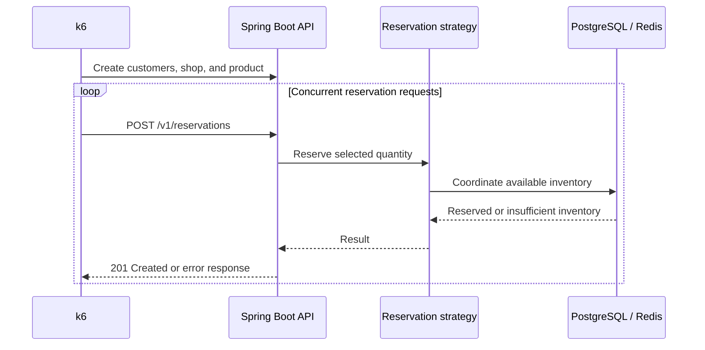
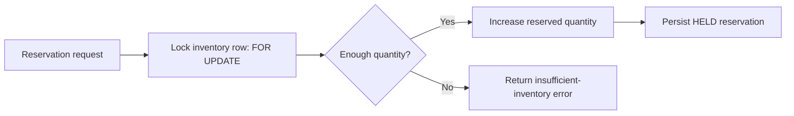
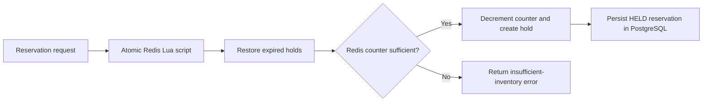
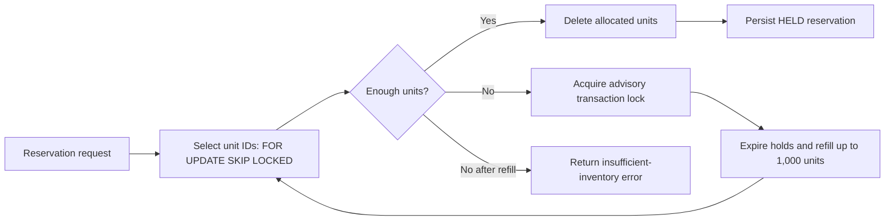

# Inventory Reservation Benchmark

Inventory Reservation Benchmark is a simplified order-reservation backend for studying how inventory reservation strategies behave under concurrent requests. It focuses on preventing overselling while many customers reserve the same product.

The project provides reproducible k6 workloads and a local monitoring stack to compare throughput, latency, lock contention, and resource use. It is a benchmark environment, not a complete e-commerce application.

## Table of Contents

- [How It Works](#how-it-works)
- [Reservation Strategies](#reservation-strategies)
- [API Reference](#api-reference)
- [Technology Stack](#technology-stack)
- [Project Structure](#project-structure)
- [Setup and Running](#setup-and-running)
- [Running k6 Benchmarks](#running-k6-benchmarks)
- [Monitoring](#monitoring)
- [Benchmark Methodology](#benchmark-methodology)
- [Troubleshooting](#troubleshooting)

## How It Works

The benchmark creates customers, one shop, and one product with an initial inventory quantity. Concurrent clients then submit reservations for the same product using one selected strategy.



For a successful reservation, the application calculates a hold expiry 15 minutes in the future, invokes the selected inventory strategy, and then stores a `HELD` reservation in PostgreSQL. When a strategy cannot supply the requested quantity, the request returns the standard error envelope. Business and validation failures currently map to HTTP `400`; unexpected errors map to `500`.

The current backend source does not configure an authentication layer.

## Reservation Strategies

Select one of these values in [`benchmark/k6/config.js`](benchmark/k6/config.js). The strategy is also sent in the reservation request body.

| Option | API value | Coordination mechanism |
| --- | --- | --- |
| `1` | `POSTGRES_PESSIMISTIC` | PostgreSQL row lock |
| `2` | `REDIS` | Redis Lua script and expiring holds |
| `3` | `POSTGRES_POOL` | PostgreSQL unit pool with `SKIP LOCKED` |

### PostgreSQL pessimistic locking (`POSTGRES_PESSIMISTIC`)

The application reads the inventory row for the product with JPA `PESSIMISTIC_WRITE`, which translates to a PostgreSQL `SELECT ... FOR UPDATE` lock. Inside the surrounding transaction, it calculates `quantity - reservedQuantity`, rejects insufficient stock, or increments `reservedQuantity`.



Requests for the same product serialize on the inventory row, keeping the availability check and update together. This can create row-lock waits under contention; concurrent callers wait for the lock holder. Insufficient inventory is rejected before a reservation is persisted.

### Redis reservation (`REDIS`)

Before the benchmark starts, the k6 setup calls `POST /v1/reservations/redis-inventory/{productId}/preload`. That endpoint reads PostgreSQL inventory and writes its current available quantity (`quantity - reservedQuantity`) to a Redis inventory key.

Each reservation executes one Lua script in Redis. The script first restores quantities from expired Redis holds, then checks the Redis counter. When enough quantity exists, it decrements the counter, creates a hold record, and adds it to an expiry-sorted set. A successful request is subsequently persisted as a `HELD` reservation in PostgreSQL with the same 15-minute expiry window.



Redis serializes the counter update and hold creation atomically. Its operational considerations are the explicit preload step, expiry processing performed by later reservation attempts, and coordination between the Redis inventory view and the PostgreSQL reservation record. If the product was not preloaded, the strategy reports inventory not found; if the counter is too small, it reports insufficient inventory.

### PostgreSQL reservation pool (`POSTGRES_POOL`)

This strategy represents allocatable stock as rows in `inventory_unit`. It attempts to select the requested unit IDs using `FOR UPDATE SKIP LOCKED` and deletes the selected rows in the same transaction. `SKIP LOCKED` lets concurrent requests bypass units another transaction has already locked.

If the pool cannot satisfy a request, the application acquires a transaction-scoped PostgreSQL advisory lock for the inventory. While holding that lock, it expires eligible `HELD` reservations for the product, returns their quantities to the available balance as needed, and refills the pool to a capacity of up to 1,000 units from expired and currently available stock. It then retries allocation.



The pool spreads allocation across unit rows and avoids waiting on already-locked units during allocation. Refill remains coordinated by the advisory lock and may become a contention point when the pool is depleted. If both the current pool and refillable inventory cannot satisfy the request, the strategy returns insufficient inventory.

## API Reference

All responses use the envelope below. On success, `success` is `true`, `code` is `SUCCESS`, and identifiers are in `data`.

```json
{
  "success": true,
  "code": "SUCCESS",
  "message": "Success",
  "data": {}
}
```

| Method | Path | Request body | Successful response |
| --- | --- | --- | --- |
| `POST` | `/v1/customers` | `{ "name": "..." }` | `201`, `data.customerId` |
| `POST` | `/v1/shops` | `{ "name": "..." }` | `201`, `data.shopId` |
| `GET` | `/v1/shops/{shopId}` | — | `200` |
| `POST` | `/v1/products` | `shopId`, `name`, `sku`, `price`, `quantity` | `201`, `data.productId` |
| `GET` | `/v1/products/{productId}` | — | `200` |
| `POST` | `/v1/reservations` | `customerId`, `productId`, `quantity`, `strategy` | `201`, `data.reservationId` |
| `POST` | `/v1/reservations/redis-inventory/{productId}/preload` | — | `200` |
| `GET` | `/v1/reservations/{reservationId}` | — | `200` |

For product creation, `shopId` must be positive; `name` and `sku` must be non-blank and at most 255 characters; `price` must be at least `0.01` with up to 17 integer and 2 fractional digits; and `quantity` must be zero or greater. Reservations require positive customer ID, product ID, and quantity, plus one of the strategy values above.

Example reservation request:

```bash
curl -X POST http://localhost:8080/v1/reservations \
  -H "Content-Type: application/json" \
  -d '{
    "customerId": 1,
    "productId": 1,
    "quantity": 1,
    "strategy": "POSTGRES_PESSIMISTIC"
  }'
```

## Technology Stack

| Component | Role |
| --- | --- |
| Java 21 and Spring Boot | Reservation API and Actuator endpoints |
| Maven | Backend build |
| PostgreSQL 17 | Persistent product, inventory, inventory-unit, and reservation data |
| Liquibase | Database schema migrations and validation source of truth |
| Redis 8 | Redis reservation counter and temporary holds |
| Docker Compose | Local stack orchestration and service networking |
| Prometheus | Scrapes application and PostgreSQL exporter metrics |
| Grafana | Provisioned dashboard and Prometheus datasource |
| pgAdmin | Optional PostgreSQL administration UI |
| k6 | Concurrent reservation workload and HTML report generation |

## Project Structure

```text
.
├── benchmark/
│   └── k6/
│       ├── config.js
│       ├── reservation.js
│       └── reports/
├── infrastructure/
│   ├── docker-compose.yml
│   ├── prometheus/
│   ├── postgres-exporter/
│   └── grafana/
├── inventory-reservation-benchmark/
│   ├── src/
│   ├── Dockerfile
│   ├── mvnw
│   └── pom.xml
├── .env.example
└── README.md
```

- `inventory-reservation-benchmark/` contains the Spring Boot backend and Liquibase migrations.
- `infrastructure/` contains the Compose stack, Prometheus configuration, PostgreSQL exporter queries, and Grafana provisioning.
- `benchmark/k6/` contains the k6 workload, its shared configuration, and generated HTML reports. HTML reports are ignored by Git.

## Setup and Running

### Prerequisites

- Docker Desktop or Docker Engine with Docker Compose v2
- Git, if cloning the repository

Java and Maven are required only when running the backend outside Docker; the Compose build uses the included Maven wrapper.

### Configure the environment

From the repository root, create a local environment file from the checked-in template:

```powershell
Copy-Item .env.example .env
```

On macOS or Linux:

```bash
cp .env.example .env
```

Set secure values in `.env`, especially `POSTGRES_PASSWORD`, `GRAFANA_ADMIN_PASSWORD`, and `PGADMIN_DEFAULT_PASSWORD`. Do not commit `.env`.

| Variable | Purpose |
| --- | --- |
| `POSTGRES_DB`, `POSTGRES_USER`, `POSTGRES_PASSWORD`, `POSTGRES_PORT` | PostgreSQL database, credentials, and host port |
| `REDIS_PORT` | Redis host port |
| `BACKEND_PORT` | Backend host port |
| `PROMETHEUS_PORT` | Prometheus host port |
| `GRAFANA_PORT`, `GRAFANA_ADMIN_USER`, `GRAFANA_ADMIN_PASSWORD` | Grafana access and initial administrator credentials |
| `PGADMIN_PORT`, `PGADMIN_DEFAULT_EMAIL`, `PGADMIN_DEFAULT_PASSWORD` | pgAdmin access and login |

### Start the stack

Run Compose from the `infrastructure` directory, where the Compose file resolves its `../.env` file and relative mounts:

```bash
cd infrastructure
docker compose config
docker compose up -d --build
```

The backend waits for healthy PostgreSQL and Redis services. Its container health check calls `http://localhost:8080/actuator/health`; Liquibase applies the schema migrations during backend startup. Inspect service state and backend startup logs with:

```bash
docker compose ps
docker compose logs -f inventory-reservation-benchmark
```

With the default ports from `.env.example`, use:

| Service | URL |
| --- | --- |
| Backend health | <http://localhost:8080/actuator/health> |
| Backend Prometheus metrics | <http://localhost:8080/actuator/prometheus> |
| Prometheus | <http://localhost:9090> |
| Grafana | <http://localhost:3000> |
| pgAdmin | <http://localhost:5050> |

Stop the stack while retaining named volumes:

```bash
docker compose down
```

## Running k6 Benchmarks

The k6 service is on demand; it does not start with `docker compose up -d`. It reaches the backend using the Compose DNS name `http://inventory-reservation-benchmark:8080`.

### Configure the workload

Edit [`benchmark/k6/config.js`](benchmark/k6/config.js). `strategyOption` chooses the strategy, and all workload values are in the exported `config` object.

```js
const strategyOption = 3; // 1: POSTGRES_PESSIMISTIC, 2: REDIS, 3: POSTGRES_POOL

export const config = {
  customerCount: 500,
  productQuantity: 1_000_000,
  reservationQuantity: 1,
  vus: 500,
  duration: '3m',
};
```

`setup()` creates the configured customers, exactly one shop, and one product. It preloads Redis only for the `REDIS` strategy. The default k6 function only submits reservations against the shared product; it does not create data during the measured workload.

From `infrastructure/`, after the backend is healthy, run:

```bash
docker compose run --rm k6
```

The script keeps these thresholds:

```text
http_req_failed   rate < 0.05
http_req_duration p(95) < 1000 ms
```

It checks that a successful reservation returns HTTP `201`, `success: true`, and a positive `data.reservationId`.

At the end of a run, the script writes an HTML report to `benchmark/k6/reports/` on the host. Its name includes the selected strategy and a UTC timestamp, for example:

```text
reports/reservation-POSTGRES_POOL-20261009-133000.html
```

Open the generated file in a browser. If it is not present, check that the `benchmark/k6/reports/` directory exists and is writable on the host; Compose mounts it at `/reports` in the k6 container.

For a fair comparison, use the same VUs, duration, customer count, reservation quantity, and initial product quantity for every strategy. Ensure stock is sufficient for the intended successful-reservation workload; after stock is depleted, failed reservations become part of the result. Treat setup as warm-up and compare repeated runs rather than a single execution.

## Monitoring

Prometheus scrapes the backend every 15 seconds at `/actuator/prometheus` and scrapes the PostgreSQL exporter at `postgres-exporter:9187`. Grafana provisions Prometheus (`http://prometheus:9090` inside Compose) as its default datasource and loads the **Inventory Reservation Benchmark** dashboard.

Sign in to Grafana at <http://localhost:3000> with the credentials configured in `.env`. Open the **Inventory Reservation Benchmark** folder and dashboard.

| Dashboard area | Configured metrics |
| --- | --- |
| HTTP | Request rate, p95 latency, and 5xx error rate |
| JVM and process | Heap memory, process CPU usage, and active HTTP requests |
| PostgreSQL connections | Active connections, idle connections, and connection usage |
| PostgreSQL activity | Transaction rate, commits, rollbacks, longest active query duration, and database size |
| Locks | Active locks, backends waiting on locks, maximum current lock-wait duration, and deadlock rate |

The PostgreSQL exporter includes custom queries for the current maximum active-query duration and lock waits. These panels help observe contention from row locks, `FOR UPDATE SKIP LOCKED`, and advisory-lock coordination without changing reservation code.

`No data` is not necessarily zero: it can mean Prometheus has not scraped yet, the exporter target is unavailable, a series has not been emitted, or the selected time range contains no samples. In Prometheus, check **Status → Targets** and confirm that `inventory-reservation-benchmark` and `postgres` are `UP` before interpreting a dashboard panel. Metrics such as deadlocks and lock waits may have no meaningful samples until the workload creates those events.

## Benchmark Methodology

Compare strategies under the same configuration and database state, and use Grafana alongside the k6 summary and HTML report.

| Dimension | What to inspect |
| --- | --- |
| Throughput | k6 request rate and the Grafana HTTP request-rate panel |
| Latency | k6 response-time distribution and p95 threshold; inspect p99 when k6 output provides it |
| Lock contention | Waiting backends, lock-wait duration, active locks, and deadlocks |
| Resource utilization | Process CPU, JVM heap, PostgreSQL connection count, and connection usage |
| Correctness | Successful reservations, failed reservations, and whether requests are rejected once usable stock is exhausted |

Pessimistic locking concentrates coordination on one inventory row. Redis moves counter and hold coordination into an atomic Redis script after an explicit preload. The pool distributes allocation over unit rows and coordinates replenishment with an advisory lock. These mechanisms have different contention and operational characteristics; benchmark results under a controlled workload should determine the practical trade-offs.

## Troubleshooting

| Symptom | What to check |
| --- | --- |
| Compose reports unset variables | Run from `infrastructure/`, create root `.env` from `.env.example`, and ensure it contains every listed variable. |
| Backend is unhealthy | Run `docker compose logs inventory-reservation-benchmark`; verify PostgreSQL and Redis are healthy, and look for Liquibase migration or database-credential errors. |
| A container cannot reach another service | Use Compose service names inside containers (`postgres`, `redis`, `prometheus`, `inventory-reservation-benchmark`), not `localhost`. |
| Prometheus or Grafana shows missing metrics | Check `docker compose ps`, then Prometheus **Status → Targets**. The backend target must expose `/actuator/prometheus`; the PostgreSQL exporter must be healthy. |
| k6 cannot connect | Start the stack first, wait for the backend health check, then run `docker compose run --rm k6` from `infrastructure/`. Do not use `localhost` in k6 configuration. |
| Many k6 reservation checks fail | Check the selected strategy, Redis preload for `REDIS`, API error bodies, and whether the initial product quantity was exhausted. |
| No HTML report appears | Confirm `benchmark/k6/reports/` exists and is writable, and that k6 completed `handleSummary`; reports are written through the `/reports` volume mount. |
